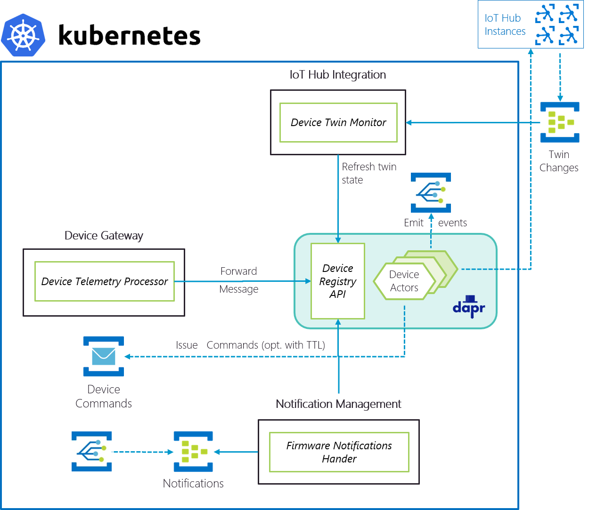

# Dapr - Actors Sandbox

Sandbox to play with Dapr Actors.

<div style="text-align: center"></div>

## How does it work?



## Try it yourself!

### Kubernetes

#### Prerequisites

Before you can start, you'll need to :

1. Install Dapr ([docs](https://github.com/dapr/docs/blob/master/getting-started/environment-setup.md#using-helm-advanced))
2. Install KEDA ([docs](https://keda.sh/docs/1.5/deploy/#helm))
3. Update YAML specs under `/deploy` with your config

#### Deploying the scenario

You are ready to go, deploy!

1. Deploy Dapr Components
```shell
$ k apply -f .\deploy\dapr-infrastructure.yaml
secret/dapr-infrastructure-secrets created
component.dapr.io/dapr-state-store created
```

2. Deploy Device Actor Host
```shell
$ k apply -f .\deploy\device-actors.yaml
secret/dapr-sandbox-actors-secrets created
deployment.apps/dapr-sandbox-actors created
```

3. Deploy Device API
```shell
$ k apply -f .\deploy\device-api.yaml
secret/dapr-sandbox-apis-device-secrets created
deployment.apps/dapr-sandbox-apis-device created
service/dapr-sandbox-apis-device-service created
service/dapr-sandbox-apis-device-load-balancer created
```

4. Deploy Twin Change Stream Processor
```shell
$ k apply -f .\deploy\twin-changes-stream-processor.yaml
secret/dapr-sandbox-twin-change-secrets unchanged
deployment.apps/twin-changes-stream-processor created
scaledobject.keda.k8s.io/twin-changes-autoscale created
```

5. Deploy Device Message Stream Processor
```shell
$ k apply -f .\deploy\device-message-stream-processor.yaml
secret/dapr-sandbox-device-telemetry-secrets created
deployment.apps/device-telemetry-stream-processor created
scaledobject.keda.k8s.io/device-telemetry-autoscale created
```

### Locally

1. Configure dependencies in `docker-compose.override.yml` 
2. Start containers with Docker Compose:

```shell
$ cd src
$ docker-compose up
```

3. Explore the API on http://localhost:880/api/docs

#### Cleanup

Stop containers with Docker Compose:

```shell
$ docker-compose down
```

### Testing

#### Sending device messages

Messages should be sent as following to Azure Event Hubs:

```raw
messageType: Telemetry
deviceId: <id>
{
  "content": "Hello Dapr!"
}
```
